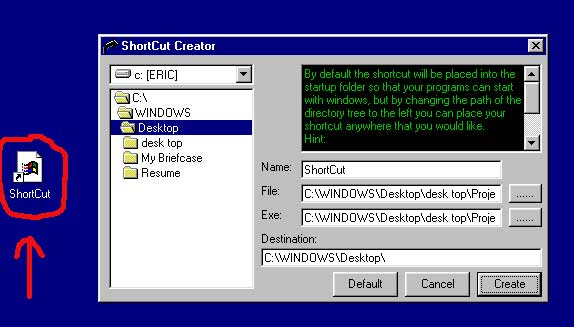



## ShortCuts,Start with windows,\.lnk files

### Description

***Update 5/23/01

Sorry guys forgot to inlude the bas modules they are uploaded now.

Updated *** Fixed a bug,Added ability to add a shortcut to the taskbar as a quicklaunch!This program will create a shortcut or .lnk file.Thanks to Dave Scarmozzino and Todd Acheson.Also demonstrates the ShellExecute,SHFileExists and WinExec api functions.Credit for the shortcut functions go to Dave Scarmozzino,I just made a pretty package.
 
### More Info
 
Zip file contains a file called SHELLLNK.TLB.

You may need to set a reference to it in your project.

             |
---                |---
**Submitted On**   |2001-05-23 11:28:24
**By**             |[Morpheous](https://github.com/Planet-Source-Code/PSCIndex/blob/master/ByAuthor/morpheous.md)
**Level**          |Intermediate
**User Rating**    |4.8 (19 globes from 4 users)
**Compatibility**  |VB 6\.0
**Category**       |[Windows System Services](https://github.com/Planet-Source-Code/PSCIndex/blob/master/ByCategory/windows-system-services__1-35.md)
**World**          |[Visual Basic](https://github.com/Planet-Source-Code/PSCIndex/blob/master/ByWorld/visual-basic.md)
**Archive File**   |[ShortCuts,199505232001\.zip](https://github.com/Planet-Source-Code/morpheous-shortcuts-start-with-windows-lnk-files__1-23223/archive/master.zip)

